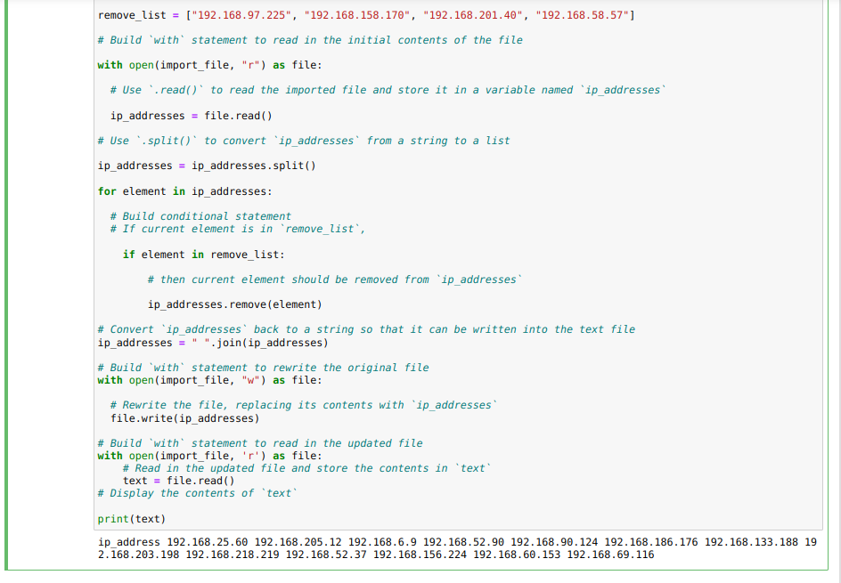

## Google Cybersecurity Professional Certificate 
# Course: Automate Cybersecurity Tasks with Python

>Project description

As a security professional employed by a healthcare company, my responsibilities include routinely updating a file that specifies which employees have access to restricted content. This file's criteria are based on individuals handling personal patient records, with employee access being limited according to their IP address. An allow list was established for IP addresses authorized to log into the restricted subnetwork, alongside a remove list pinpointing employees whose access needed revocation.

The challenge was to devise an algorithm employing Python to ascertain whether the allow list comprised any IP addresses flagged on the remove list. Detected matches necessitated the removal of these IP addresses from the allow list file.

### My Algorithm

>Initially, I opened the file containing the allow list.

> Subsequently, I read the file's contents.

> It became apparent that some IP addresses on the remove list coincided with those on the allow list. To manipulate these IP addresses effectively, I converted the data structure into a list using the built-in [split()](https://docs.python.org/3/library/stdtypes.html#str.split) method.

> Following this, I crafted a conditional statement to exclude all IP addresses from the allow list that were designated for restricted access.

> The subsequent step involved converting the IP addresses back into a string format to update the original file. This conversion was accomplished using the [.join()](https://pythonbasics.org/join/) method, a necessary step since IP addresses must be in string format to rewrite the file within a with statement.

> I then encapsulated all the preceding code into a singular function, enhancing its reusability. This function can now be utilized on any file by anyone seeking to implement this algorithm.

> Finally, upon testing my function, I confirmed its flawless operation.

> Feel free to make a contribution.

